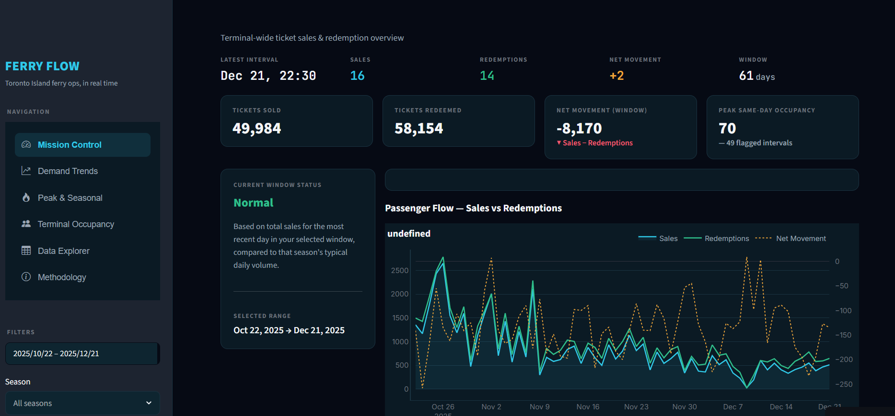
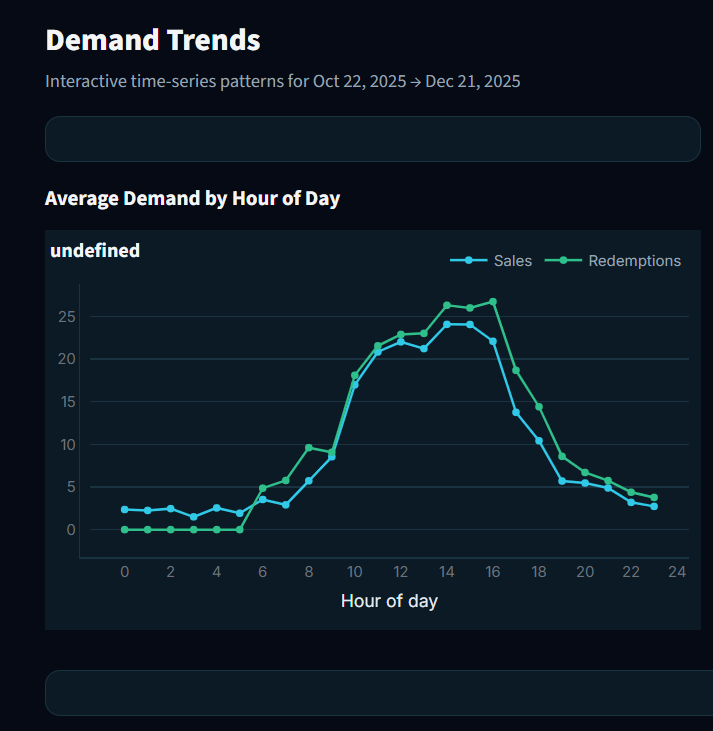
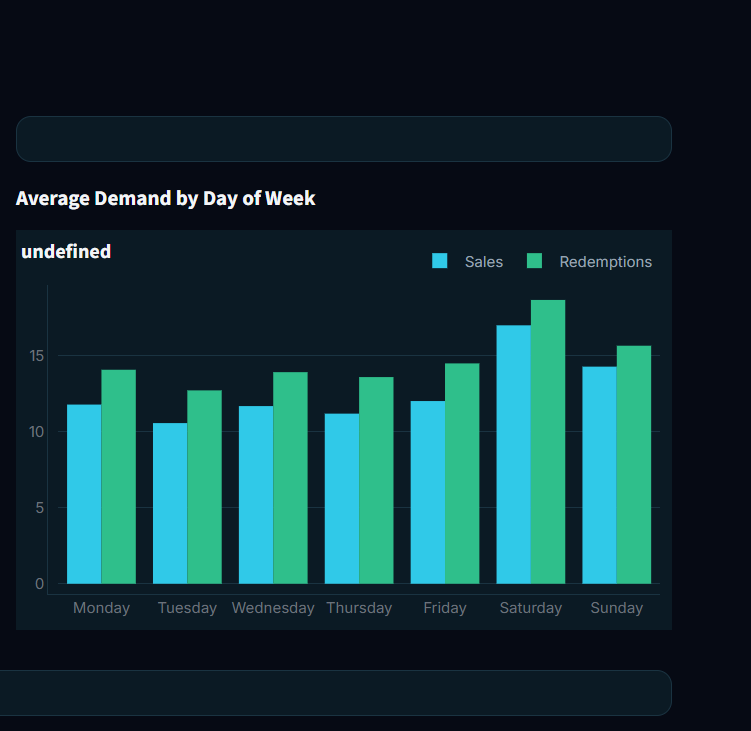
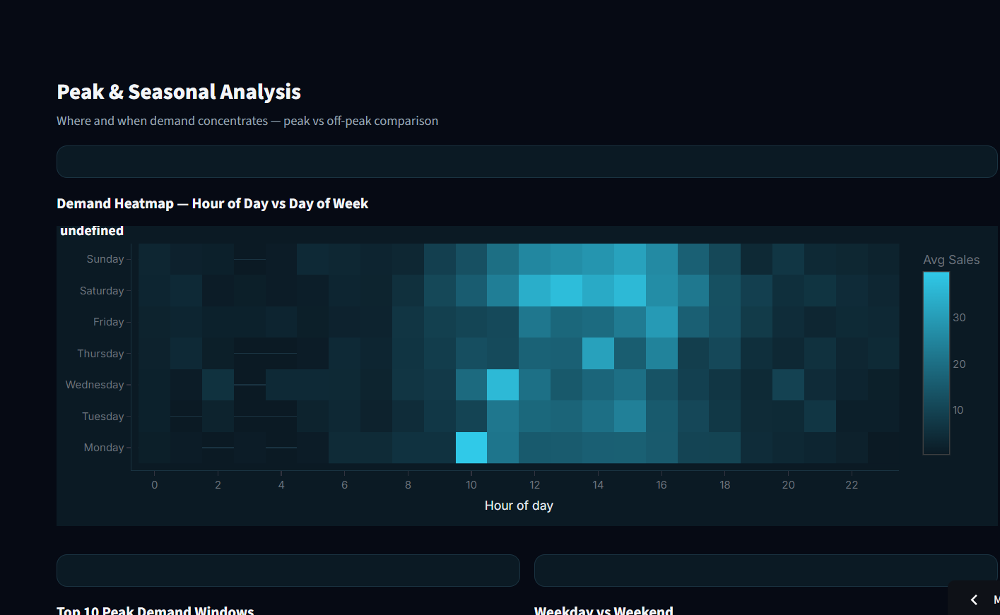
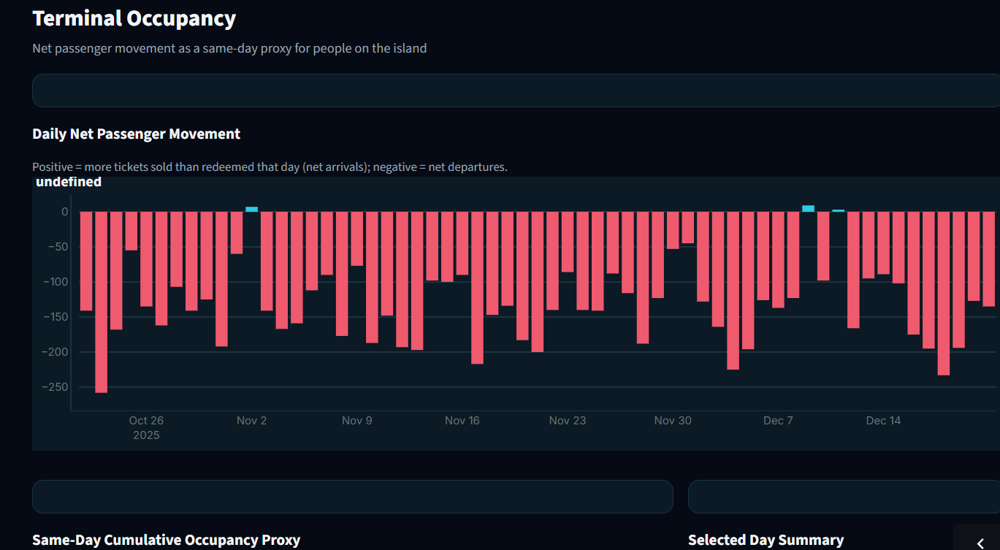
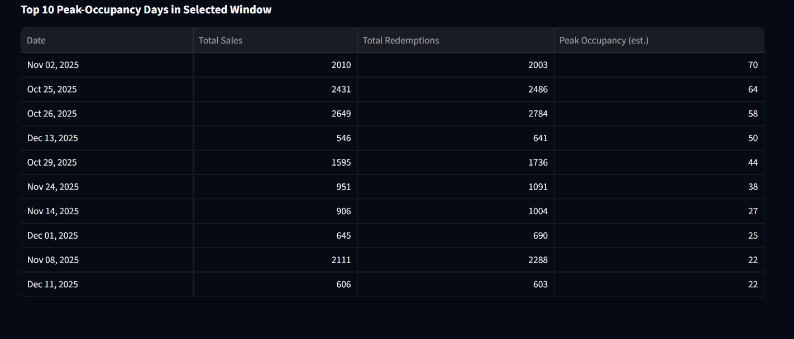
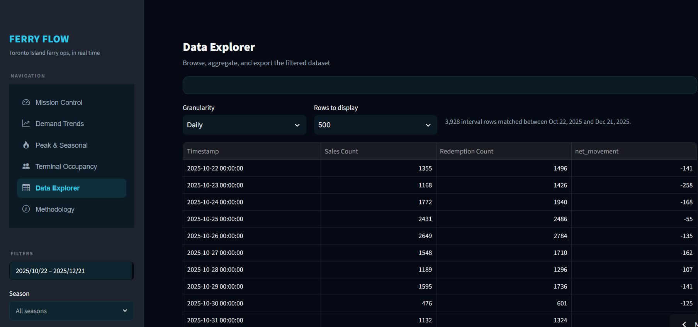

# Real-Time Ferry Ticket Sales & Redemption Analytics
### Toronto Island Park — Jack Layton Ferry Terminal

Client: Unified Mentor / Toronto Government, Parks, Forestry & Recreation

Live Demo: https://chandini-ferry-analytics.streamlit.app/

## Dashboard Preview
### Mission Control



The executive dashboard provides a real-time overview of ferry operations, including ticket sales, redemptions, net passenger movement, operational KPIs, and passenger flow trends.

---

### Demand Trends

| Hourly Demand | Weekly Demand |
|---------------|---------------|
|  |  |

Analyze passenger demand across different hours of the day and days of the week to identify consistent travel patterns.

---

### Peak & Seasonal Analysis



Visualize seasonal demand, identify high-traffic periods, and explore demand intensity using interactive heatmaps.

---

### Terminal Occupancy

| Daily Occupancy | Peak Occupancy |
|-----------------|----------------|
|  |  |

Estimate passenger occupancy, monitor daily movement, and identify days with the highest terminal utilization.

---

### Data Explorer



Interactively browse, filter, and export the processed ferry dataset at different aggregation levels.

---
## Overview

The Real-Time Ferry Demand Analytics Dashboard is an interactive business intelligence application developed to analyze ferry ticket sales and passenger demand for the Jack Layton Ferry Terminal, Toronto Island Park.

The project transforms raw ticket transaction data into meaningful operational insights through data preprocessing, exploratory data analysis, KPI generation, and an interactive Streamlit dashboard. It enables users to monitor passenger demand, identify peak travel periods, evaluate seasonal trends, and explore terminal occupancy using an intuitive interface.

## Objectives
1. Analyze historical ferry ticket sales data.
2. Identify passenger demand patterns across different time periods.
3. Monitor key operational performance indicators.
4. Detect peak travel windows and seasonal variations.
5. Support data-driven operational planning and resource allocation.

## Key Features
    Interactive KPI dashboard
    Passenger demand trend analysis
    Seasonal and weekday comparisons
    Peak travel window identification
    Terminal occupancy estimation
    Rolling average analysis
    Dynamic filtering by date, season, and day type
    CSV export functionality
    Interactive Plotly visualizations
    Responsive Streamlit interface
    
## Project Structure

```
ferry_project/
├── notebook/
│   └── Ferry_Analytics_Preprocessing_EDA.ipynb   # Run this FIRST (Jupyter)
├── data/
│   ├── Toronto_Island_Ferry_Tickets.csv          # Raw source data
│   └── processed/                                # Generated by the notebook
│       ├── ferry_cleaned_full.csv
│       ├── ferry_daily_agg.csv
│       ├── ferry_kpi_hourly.csv
│       ├── ferry_kpi_summary.csv
│       ├── ferry_peak_windows.csv
│       └── *.png (EDA chart exports)
└── streamlit_app/                                # Run this SECOND (VS Code)
    ├── app.py
    ├── requirements.txt
    ├── .streamlit/config.toml
    ├── utils/
    │   ├── data_loader.py
    │   ├── styling.py
    │   └── sidebar.py
    ├── views/
    │   ├── mission_control.py
    │   ├── demand_trends.py
    │   ├── peak_seasonal.py
    │   ├── terminal_occupancy.py
    │   ├── data_explorer.py
    │   └── methodology.py
    └── data/processed/                           # Copy of the notebook's exports
```
### INSTALLATION

## 1. Run the Jupyter Notebook (preprocessing + EDA)

```bash
cd notebook
pip install jupyter pandas numpy matplotlib seaborn
jupyter notebook Ferry_Analytics_Preprocessing_EDA.ipynb
```

Run all cells top to bottom. It will:
- Load and clean `data/Toronto_Island_Ferry_Tickets.csv`
- Engineer time-based features (hour, day, season, weekend flag)
- Produce the full EDA (hourly/seasonal/rolling-average charts, heatmap)
- Compute all required KPIs
- Export compact CSVs into `data/processed/` that the dashboard reads

**You only need to re-run this if the raw data changes.** The dashboard doesn't touch the
raw 260k-row file directly — it reads the small pre-aggregated exports, so it loads instantly.

## 2. Run the Streamlit Dashboard (VS Code)

Open the `streamlit_app/` folder in VS Code, then in its integrated terminal:

```bash
cd streamlit_app
python -m venv venv
source venv/bin/activate        # Windows: venv\Scripts\activate
pip install -r requirements.txt
streamlit run app.py
```

The app opens at `http://localhost:8501`.

### Pages
| Page | What it shows |
|---|---|
| **Mission Control** | KPI overview, live-style readouts, passenger-flow hero chart, and an optional "Live Replay" mode that ticks through the most recent day's 15-min intervals to simulate a real-time feed |
| **Demand Trends** | Hourly and day-of-week averages, 1-hr / 4-hr rolling averages |
| **Peak & Seasonal** | Hour × day-of-week heatmap, top peak windows, weekday/weekend and seasonal comparison, Off-Season Utilization Index |
| **Terminal Occupancy** | Daily net passenger movement, same-day cumulative occupancy proxy, top peak-occupancy days |
| **Data Explorer** | Filterable table (15-min / hourly / daily granularity) with CSV export |
| **Methodology** | Data source, cleaning approach, and KPI definitions |

All pages share the same sidebar filters (date range, season, weekday/weekend, outlier
inclusion) so every view stays in sync with the selected window.

## Business Value

This dashboard assists transportation authorities in:

    Understanding passenger demand patterns
    Identifying peak operating hours
    Evaluating seasonal travel behavior
    Improving ferry scheduling
    Supporting staffing and operational planning
    Monitoring terminal activity through interactive analytics

Author

Chandini Narayana

Bachelor of Engineering in Computer Science (Artificial Intelligence & Machine Learning)

GitHub: https://github.com/chandini-narayana


